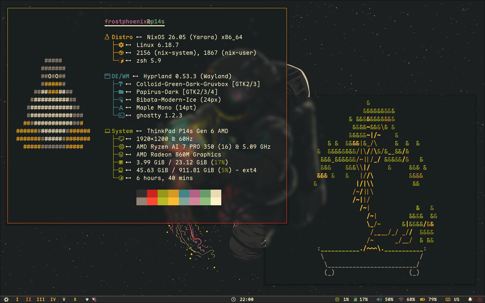
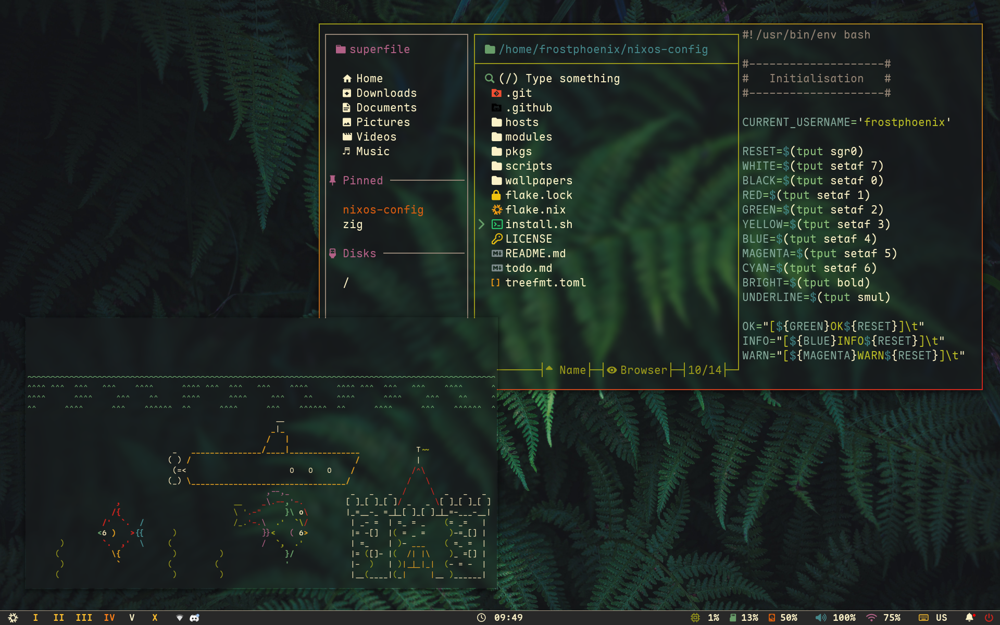
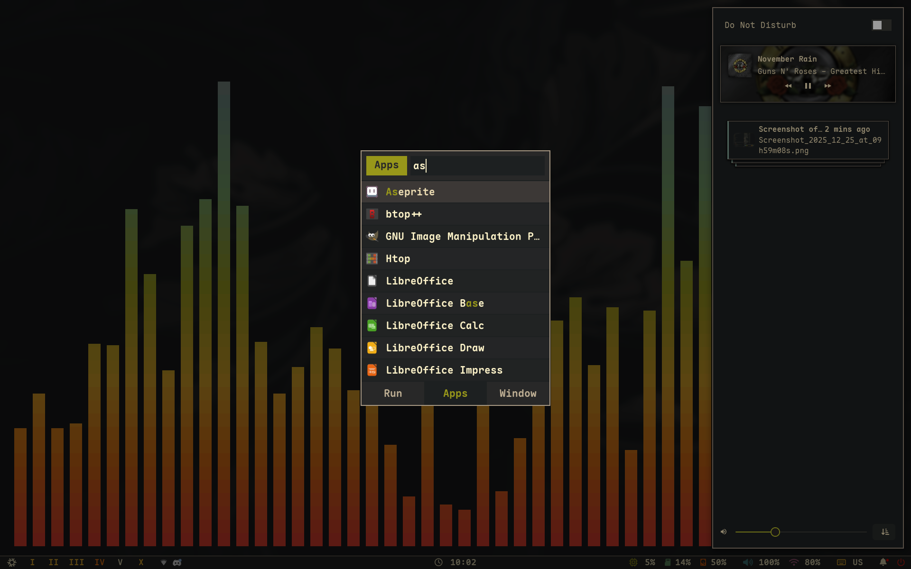
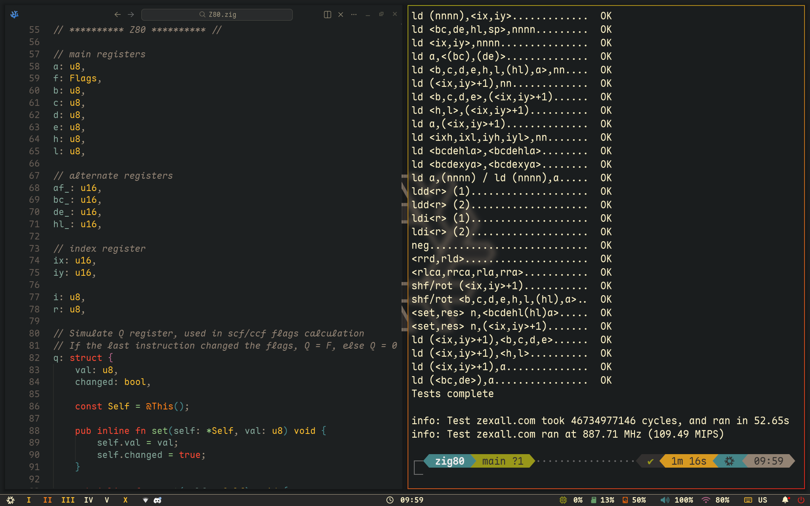
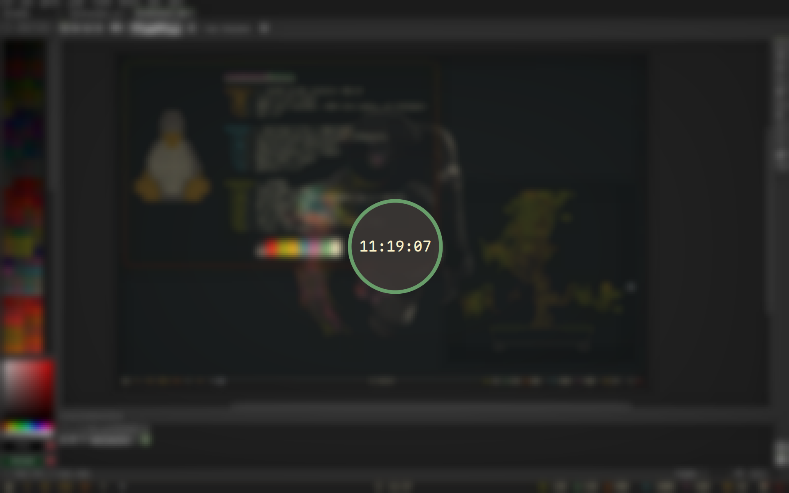
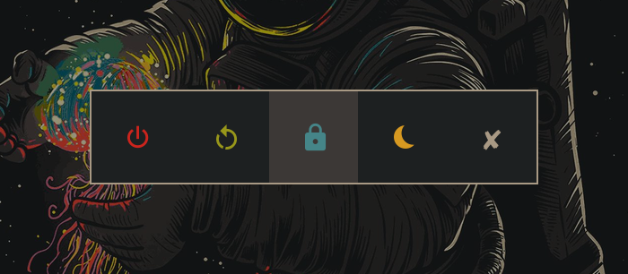
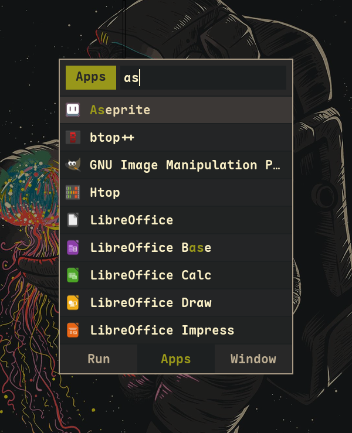
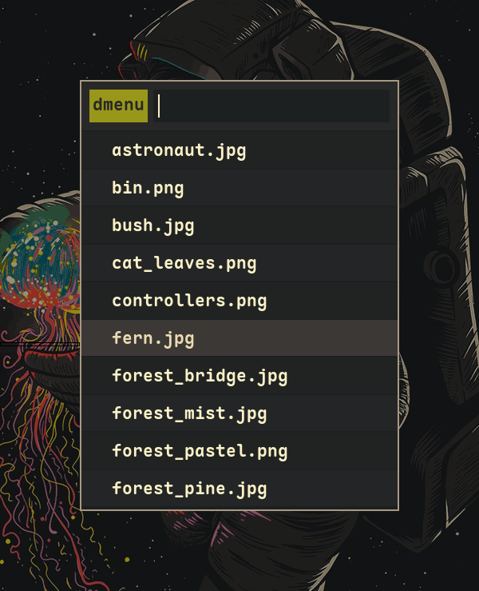
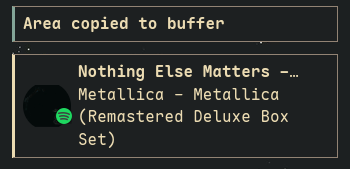
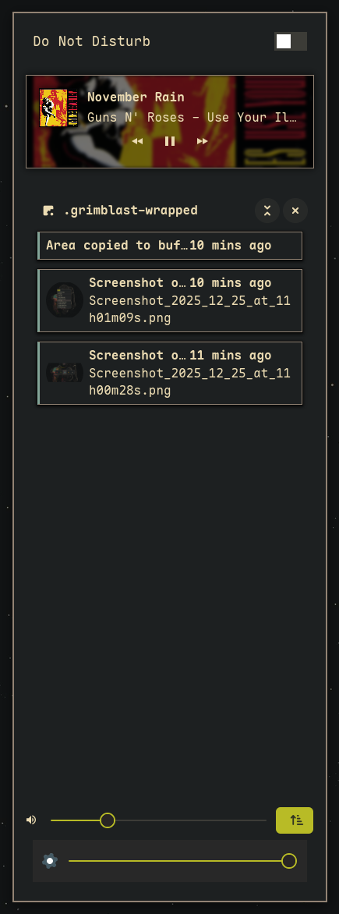

<h1 align="center">
    
   <br>
      Frost-Phoenix's Flakes 
   <br>
       <br>

   <div align="center">
      <p></p>
      <div align="center">
         <a href="https://github.com/Frost-Phoenix/nixos-config/stargazers">
            
         </a>
         <a href="https://github.com/Frost-Phoenix/nixos-config/">
            
         </a>
         <a = href="https://nixos.org">
            
         </a>
         <a href="https://github.com/Frost-Phoenix/nixos-config/blob/main/LICENSE">
            
         </a>
      </div>
      <br>
   </div>
</h1>

### 🖼️ Gallery

<p align="center">
    <br>
    <br>
    <br>
    <br>
   Screenshots last updated <b>2025-12-25</b>
</p>

<details>
<summary>
   Swaylock (EXPAND)
</summary>
    <br>
</details>
<details>
<summary>
   Power menu (EXPAND)
</summary>
    <br>
</details>
<details>
<summary>
   Launcher (EXPAND)
</summary>
    <br>
</details>
<details>
<summary>
   Wallpapers picker (EXPAND)
</summary>
    <br>
</details>
<details>
<summary>
   Notification (EXPAND)
</summary>
    <br>
</details>
<details>
<summary>
   Notification center (EXPAND)
</summary>
    <br>
</details>

You can find my previous Catppuccin rice [here](https://github.com/Frost-Phoenix/nixos-config/tree/catppuccin) (outdated).

# 🗃️ Overview

> [!IMPORTANT]
> This is my **personal** NixOS configuration, shared for reference and inspiration.
>
> **Please be aware:**
> - This configuration is constantly evolving - expect breaking changes
> - The README and documentation are most likely outdated
> - Features may be partially implemented or broken
> - I provide **no guarantees** of stability
>
> **Before using any part of this configuration:**
> 1. Review the code thoroughly
> 2. Understand what each module does
> 3. And adapt it to your specific needs

## 📚 Layout

One portable SSD boots two machines. There is a single system configuration:
the **laptop is the base**, and the **AMD/NVIDIA tower is a NixOS
`specialisation` inside it** with its own signed boot entry — you pick the
machine from the boot menu, not by rebuilding. The base has to be the minimal
machine because the module system adds cleanly but cannot remove.

-   [flake.nix](flake.nix) Base of the configuration
-   [hosts](hosts) Bootable configurations
    -   [portable](hosts/portable/) The one real config: shared hardware, the disko layout, and the `desktop` specialisation
    -   [iso](hosts/iso/) Installer ISO, with the install script baked in
-   [machines](machines) Per-machine modules, gated on `machine.profile`
    -   [laptop](machines/laptop/) ASUS Vivobook — TLP, Intel VA-API, audio quirk
    -   [desktop](machines/desktop/) AMD tower — NVIDIA, Steam, OpenRGB/DDC, TV audio
-   [modules](modules) Modularized NixOS configurations
    -   [core](modules/core/) Configuration shared by BOTH machines
    -   [homes](modules/home/) My [Home-Manager](https://github.com/nix-community/home-manager) configuration
-   [pkgs](pkgs) Custom packages build from source
-   [scripts](scripts) Custom shell scripts
-   [assets/wallpapers](assets/wallpapers/) The vendored wallpaper

## 🛠️ System Components & Applications

| Component | Software |
| --- | :---: |
| **Window Manager**          | [sway][sway] (laptop) / [Hyprland][Hyprland] (tower) |
| **Bar**                     | swaybar + [i3status-rust][i3status-rust] (laptop) / [noctalia][noctalia] (tower) |
| **Application Launcher**    | [fuzzel][fuzzel] (laptop) / [noctalia][noctalia] (tower) |
| **Notification Daemon**     | [mako][mako] (laptop) / [noctalia][noctalia] (tower) |
| **Terminal Emulator**       | [kitty][kitty] |
| **Shell**                   | [zsh][zsh] + [powerlevel10k][powerlevel10k] |
| **Text Editor**             | [VSCodium][VSCodium] + [Neovim][Neovim] |
| **network management tool** | [NetworkManager][NetworkManager] + [network-manager-applet][network-manager-applet] |
| **System resource monitor** | [Btop][Btop] |
| **File Manager**            | [Dolphin][Dolphin] |
| **Fonts**                   | [Maple Mono][Maple Mono] |
| **Color Scheme**            | Eldritch, frozen at build time in [`modules/home/theme.nix`](modules/home/theme.nix) |
| **GTK theme**               | [Colloid gtk theme][Colloid gtk theme] |
| **Cursor**                  | Nordzy-catppuccin-macchiato-dark |
| **Icons**                   | Tela-circle-purple-dark |
| **Lockscreen**              | [swaylock][swaylock] (both machines, via ext-session-lock-v1) |
| **Image Viewer**            | [imv][imv] |
| **Media Player**            | [mpv][mpv] |
| **Music Player**            | [mpd][mpd] + [rmpc][rmpc] (laptop) / Spotify + [spicetify][spicetify] (tower) |
| **Screenshot Software**     | [grimshot][grimshot] (sway) / [grimblast][grimblast] (Hyprland) |
| **Screen Recording**        | [wf-recorder][wf-recorder] + [OBS][OBS] |
| **Clipboard**               | [wl-clip-persist][wl-clip-persist] |
| **Color Picker**            | [hyprpicker][hyprpicker] |


## 📝 Shell aliases

Shell aliases are defined in two places. You can find git related aliases in [`git.nix`](./modules/home/git.nix), and all the others in [`zsh_alias.nix`](./modules/home/zsh/zsh_alias.nix).

Some notable ones that can help you are:

| Alias | Command | Purpose |
|-------|---------|---------|
| `nft` | `nh-notify nh os test`   | Test configuration changes without modifying the bootloader |
| `nfs` | `nh-notify nh os switch` | Rebuild and activate the new system configuration |
| `nfu` | `nix flake update --flake ~/nixos-config nixpkgs hyprland && nh-notify nh os switch` | Update `nixpkgs` and `hyprland` flake inputs only, then rebuild/activate |
| `ns`  | `nom-shell --run zsh` | Enter a nix shell |
| `nd`  | `nom develop --command zsh` | Enter a development environment from a `flake.nix` file |
| `nb`  | `nom build` | Build packages exported by a flake |
| `nc`  | `nh-notify nh clean all --keep 5` | Clean up old Nix generations, keeping only the 5 most recent |
| `nsearch` | `nh search` | Search nixpkgs for available packages |

## 🛠️ Custom Scripts

All of the scripts are in the [`./scripts/scripts/`](./scripts/scripts/) folder and are exported as packages in [`./scripts/scripts.nix`](./scripts/scripts.nix).

Shell scripts are automatically discovered and exported as standalone packages. The package name becomes the script base name without its extension (i.e., `ascii.sh` will become the `ascii` command).

**Note:** Scripts must have names that end with `.sh` and be tracked by git to be automatically detected.
 
**Since scripts are exposed as packages, you can**:
- Run them directly from the terminal (e.g., `ascii`)
- Bind them to keybindings (see [binds.nix](./modules/home/hyprland/binds.nix) for examples)
- Call them from other scripts or automation tools

**To add your own script**:
1. Add a new `.sh` file to `./scripts/scripts/`
2. Ensure it's executable (chmod +x)
3. Add it to git (git add `./scripts/scripts/<name>.sh`)
4. Rebuild your configuration (`nfs` or `nft`)
5. The script will be automatically available as a command

**Location:** [`./scripts/`](./scripts/)

```
scripts/
├── scripts/            # All shell scripts are here
│   └── <script>.sh
└── scripts.nix         # Automatic scripts packaging
```

## ⌨️ Keybinds

Keybindings are defined per compositor: [`sway/binds.nix`](./modules/home/sway/binds.nix) on the laptop and [`hyprland/binds.nix`](./modules/home/hyprland/binds.nix) on the tower. 

**Quick access:** Press `$mod F1` to view all keybinds.

Here are some of the main keybinds:

| Category | Key Examples | Purpose |
|----------|--------------|---------|
| **Navigation** | `$mod + 0-9/arrow keys` | workspace & window navigation |
| **Applications** | `$mod + return/d/b/e` | terminal, launcher, browser, file manager |
| **Window Control** | `$mod + q/f/space` | close, fullscreen, float windows |
| **Media & Tools** | `Print`, `$mod + c/w` | screenshots, color picker, wallpaper picker |
| **System** | `$mod + escape/shift escape` | lockscreen, power menu |

# 🚀 Installation

> [!CAUTION]
> This is a **personal** configuration. Use at your own risk. Always review and adapt the configuration to your needs before installation.

> [!WARNING]
> **VM Usage Notice:** Hyprland does **not** officially support virtual machines. While it often works, you may encounter graphical issues or performance problems depending on your VM configuration. See Hyprland's [VM guide](https://wiki.hypr.land/Getting-Started/Master-Tutorial/#vm).

### Bootstrap procedure (fresh device)

This config is set up for two specific machines sharing one portable SSD (an Intel ASUS Vivobook and an AMD tower with an RTX 5060 Ti; Secure Boot via Lanzaboote, sops-nix for secrets). There are host-specific gotchas you have to walk through by hand. Read this section before running anything.

The supported install path is the **ISO in this repo** (`nix build .#iso`), which bakes the flake in at `/etc/nixos-config` and ships an `install-nixos` script that runs disko, rewrites the mount UUIDs, and calls `nixos-install`. The old top-level `install.sh` was upstream fork cruft and has been removed: it offered hosts (`desktop`/`p14s`/`vm`) that are not configurations here, patched a `modules/home/aseprite/` module that does not exist, and copied `hardware-configuration.nix` into `hosts/$HOST/` — a path nothing imports under the current layout.

#### 1. Install NixOS

Boot any official [NixOS ISO](https://nixos.org/download.html#nixos-iso). The graphical installer's "No desktop" option works fine. Complete the install and reboot into the base system before continuing.

#### 2. Clone the repo

```bash
nix-shell -p git
git clone https://github.com/Haroun-Trabelsi/nixos-config ~/nixos-config
cd ~/nixos-config
```

The configuration expects the repo at `$HOME/nixos-config`.

#### 3. Update the mount UUIDs

There is no `hardware-configuration.nix`. The mounts live in [`hosts/portable/hardware-shared.nix`](hosts/portable/hardware-shared.nix) with the root / ESP / swap UUIDs of the **current** SSD hardcoded — one filesystem on one portable disk, so they are shared by both machines by definition. On a fresh disk they will not match, and the system will not boot.

`install-nixos` (from the ISO) rewrites all three automatically after disko has formatted the target, and asks you to confirm them. If you are installing by hand instead:

```bash
lsblk -o NAME,SIZE,TYPE,FSTYPE,UUID
$EDITOR hosts/portable/hardware-shared.nix   # root, /boot and swap UUIDs
```

Everything else in that file is deliberate and does **not** come from `nixos-generate-config`: the `uas`/`usb_storage` initrd modules (root is on a USB 3.0 UAS enclosure), and **both** CPU microcodes, because the disk boots an Intel laptop and an AMD tower and the kernel picks by vendor at runtime. Do not let a generated file overwrite those.

#### 4. (Optional) Update the disk path in `disko.nix`

[`hosts/portable/disko.nix`](hosts/portable/disko.nix) pins `device = "/dev/disk/by-id/ata-USSD_512GB_..."` — the serial of the *current* SSD. To partition a fresh disk, replace that value with the new disk's `by-id` path (`ls /dev/disk/by-id`). If you are not partitioning with disko, this file is unused at activation time.

#### 5. Bootstrap Secure Boot (Lanzaboote)

This config force-disables `systemd-boot` and uses [Lanzaboote](https://github.com/nix-community/lanzaboote) for Secure Boot. **The system will not boot after activation unless keys are enrolled first.**

In your firmware UI, put Secure Boot into **Setup Mode** (clear factory keys), then:

```bash
# generate keys
sudo nix run nixpkgs#sbctl -- create-keys

# enroll Microsoft + your keys (Microsoft keys are needed for OptionROMs)
sudo nix run nixpkgs#sbctl -- enroll-keys --microsoft
```

After enrollment, re-enable Secure Boot in firmware. The first `nixos-rebuild switch` after this step will sign the bootloader and kernel.

#### 6. Bootstrap sops age key

Secrets in `secrets/secrets.yaml` are encrypted with [sops-nix](https://github.com/Mic92/sops-nix). The age private key is **not** in the repo — restore it from your backup:

```bash
mkdir -p ~/.config/sops/age
# copy your existing age key into:
#   ~/.config/sops/age/keys.txt   (chmod 600)
```

Without this file, `nixos-rebuild` will fail to materialize `/run/secrets/github_personal_access_token` and `/run/secrets/ssh_id_github`. The shell will still boot, but GitHub SSH and any tooling that reads the PAT will silently fail.

If you don't have the age key, you can either re-encrypt `secrets/secrets.yaml` with a new key (`sops` + new recipient in `.sops.yaml`) or temporarily delete `secrets/secrets.yaml` — `modules/core/sops.nix` is wrapped in `lib.mkIf hasSecrets` and will no-op without it.

#### 7. Build

From the ISO, run `install-nixos`: it prompts for a username, shows the target disk, runs disko, rewrites the mount UUIDs (step 3) and calls `nixos-install`.

On an already-running system, build the config directly:

```bash
sudo nixos-rebuild switch --flake .#portable
```

`.#desktop` is an alias for the same configuration — `networking.hostName` is `"desktop"` on both machines, and `nh os switch` resolves `.#<hostname>`.

> [!NOTE]
> If the build OOMs, limit parallelism:
>
> ```bash
> sudo nixos-rebuild switch --cores 4 --flake .#portable
> ```

To check both machines build before you trust either:

```bash
nix flake check   # builds the laptop base, the desktop specialisation, and the ISO
```

#### 8. Reboot

Every generation produces **two** boot entries: the base (laptop) and `…-specialisation-desktop` (the tower). Pick the one matching the machine you are on; there is no rebuild needed when you move the disk. Lanzaboote signs both.

If everything succeeded, greetd logs you straight into sway (laptop) or Hyprland (tower). If you see GRUB / systemd-boot instead of Lanzaboote, step 5 was skipped or the keys weren't enrolled — recover via the previous generation, redo step 5, then `nfs` again.

#### 9. Post-install manual steps

A few things aren't (and can't be) automated by nix:

- **Git identity** — edit `modules/home/git.nix` with your name + email, then `nfs`.
- **claude-code** — `modules/home/zsh/zsh.nix` exports `CLAUDE_CODE_*` env vars but the binary itself is installed via npm (the nixpkgs version lags). Run `npm i -g @anthropic-ai/claude-code` after first login.
- **Browser** — Thorium is launched at startup; extensions, profiles, and bookmarks are not managed by nix.
- **Linear → Claude plan bookmarklet** — `modules/home/linear-plan.nix` registers the `claude-plan://` handler (`linear-plan` script, workspace 8 with overflow to 5) and drops the bookmarklet at `~/.local/share/linear-plan/bookmarklet.js`. Bookmarks aren't nix-managed, so add it by hand once: new bookmark on the bookmarks bar, paste the file's contents as the URL. Clipboard fallback is `$mod SHIFT P`.
- **Hyprland monitors / workspaces** (tower only) — `modules/home/hyprland/monitors.nix` sources `~/.config/hypr/{monitors,workspaces}.conf` (both wrapped with `noerror`). Drop in per-machine config files if you want monitor placement / workspace rules.
- **Failing-DIMM `memmap` reservations** — [`machines/desktop/default.nix`](machines/desktop/default.nix) reserves bad pages found by MemTest86 on the tower's RAM. They are desktop-only on purpose: applied on the laptop they would reserve addresses at random. If you build on different hardware, **delete the `memmap=` kernelParams**.

### Known fragile spots

A non-exhaustive list of things that are tied to the current install and worth re-checking when you wipe:

- [`hosts/portable/disko.nix`](hosts/portable/disko.nix) — disk `by-id` is hardware-specific.
- [`hosts/portable/hardware-shared.nix`](hosts/portable/hardware-shared.nix) — all `fileSystems` / `swapDevices` UUIDs.
- [`modules/core/wayland.nix`](modules/core/wayland.nix) — `SSH_AUTH_SOCK` hardcodes UID `1000`. Fine for the single user here, latent bug if uid differs.
- `pkiBundle = "/var/lib/sbctl"` in [`modules/core/bootloader.nix`](modules/core/bootloader.nix) — the Secure Boot keys live on the shared root, which is what lets a rebuild on the laptop still produce UKIs the tower accepts. Back them up; losing them means re-enrolling in firmware.
- The age key at `~/.config/sops/age/keys.txt` is not in the repo and not derivable. Without it a fresh install has no secrets, and `modules/home/sops-env.nix` fails silently rather than loudly.
- `boot.kernelPackages = pkgs.linuxPackages_latest` in [`modules/core/bootloader.nix`](modules/core/bootloader.nix) — a `nix flake update` can break the out-of-tree `ddcci-driver` or the NVIDIA open module, and only on the tower.

# 👥 Credits

Other dotfiles that I ~~copied~~ learned from:

- Nix Flakes
  - [nomadics9/NixOS-Flake](https://github.com/nomadics9/NixOS-Flake): This is where I start my nixos / hyprland journey.
  - [samiulbasirfahim/Flakes](https://github.com/samiulbasirfahim/Flakes): General flake / files structure
  - [justinlime/dotfiles](https://github.com/justinlime/dotfiles): Mainly waybar (old design)
  - [skiletro/nixfiles](https://github.com/skiletro/nixfiles): Vscodium config (that prevent it to crash)
  - [fufexan/dotfiles](https://github.com/fufexan/dotfiles)
  - [tluijken/.dotfiles](https://github.com/tluijken/.dotfiles): base rofi config
  - [mrh/dotfiles](https://codeberg.org/mrh/dotfiles): base waybar config

- README
  - [ryan4yin/nix-config](https://github.com/ryan4yin/nix-config)
  - [NotAShelf/nyx](https://github.com/NotAShelf/nyx)
  - [sioodmy/dotfiles](https://github.com/sioodmy/dotfiles)
  - [Ruixi-rebirth/flakes](https://github.com/Ruixi-rebirth/flakes)

- And many others I probably forgot to mention.

# 📜 License

This project is licensed under the **MIT License** - see the [LICENSE](./LICENSE) file for details.

<!-- # ✨ Stars History

<p align="center"></p> -->

<p align="center"></p>

<!-- end of page, send back to the top -->

<div align="right">
  <a href="#readme">Back to the Top</a>
</div>

<!-- Links -->

[Hyprland]: https://github.com/hyprwm/Hyprland
[sway]: https://swaywm.org/
[i3status-rust]: https://github.com/greshake/i3status-rust
[noctalia]: https://github.com/noctalia-dev/noctalia-shell
[fuzzel]: https://codeberg.org/dnkl/fuzzel
[mako]: https://github.com/emersion/mako
[kitty]: https://sw.kovidgoyal.net/kitty/
[Dolphin]: https://apps.kde.org/dolphin/
[swaylock]: https://github.com/swaywm/swaylock
[mpd]: https://www.musicpd.org/
[rmpc]: https://github.com/mierak/rmpc
[spicetify]: https://github.com/spicetify/cli
[grimshot]: https://github.com/OctopusET/sway-contrib
[powerlevel10k]: https://github.com/romkatv/powerlevel10k
[Btop]: https://github.com/aristocratos/btop
[zsh]: https://ohmyz.sh/
[mpv]: https://github.com/mpv-player/mpv
[VSCodium]:https://vscodium.com/
[Neovim]: https://github.com/neovim/neovim
[VSCodium]: https://vscodium.com/
[grimblast]: https://github.com/hyprwm/contrib
[imv]: https://sr.ht/~exec64/imv/
[Maple Mono]: https://github.com/subframe7536/maple-font
[NetworkManager]: https://wiki.gnome.org/Projects/NetworkManager
[network-manager-applet]: https://gitlab.gnome.org/GNOME/network-manager-applet/
[wl-clip-persist]: https://github.com/Linus789/wl-clip-persist
[wf-recorder]: https://github.com/ammen99/wf-recorder
[hyprpicker]: https://github.com/hyprwm/hyprpicker
[Colloid gtk theme]: https://github.com/vinceliuice/Colloid-gtk-theme
[OBS]: https://obsproject.com/
